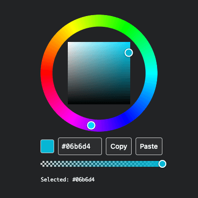

# react-hsv-ring

[](https://github.com/usapopopooon/react-hsv-ring/actions/workflows/ci.yml)  [](https://usapopopooon.github.io/react-hsv-ring/storybook/?path=/docs/components-colorwheel--docs) [](https://www.npmjs.com/package/react-hsv-ring) [](https://opensource.org/licenses/MIT)

A fully accessible color wheel component for React, following the [Radix UI](https://www.radix-ui.com/) Compound Components pattern.

## Screen Shot Example

<p alt="Screen Shot Example" align="center"></p>

## Features

- **Compound Components** - Compose your own color picker with full control
- **Accessible** - Keyboard navigation, ARIA attributes, screen reader support
- **Alpha Support** - Optional transparency slider
- **Copy/Paste** - Built-in clipboard functionality
- **TypeScript** - Full type definitions included
- **Unstyled** - Bring your own styles or use with Tailwind CSS

## Installation

```bash
npm install react-hsv-ring
```

**Peer Dependencies:** React 18 or 19

## Quick Start

```tsx
import { useState } from 'react'
import * as ColorWheel from 'react-hsv-ring'

function App() {
  const [color, setColor] = useState('#3b82f6')

  return (
    <ColorWheel.Root value={color} onValueChange={setColor}>
      <ColorWheel.Wheel size={200} ringWidth={20}>
        <ColorWheel.HueRing />
        <ColorWheel.HueThumb />
        <ColorWheel.Area />
        <ColorWheel.AreaThumb />
      </ColorWheel.Wheel>
    </ColorWheel.Root>
  )
}
```

## Full Example

```tsx
import { useState } from 'react'
import * as ColorWheel from 'react-hsv-ring'

function ColorPicker() {
  const [color, setColor] = useState('#3b82f6')

  return (
    <ColorWheel.Root value={color} onValueChange={setColor}>
      <ColorWheel.Wheel size={240} ringWidth={24}>
        <ColorWheel.HueRing />
        <ColorWheel.HueThumb />
        <ColorWheel.Area />
        <ColorWheel.AreaThumb />
      </ColorWheel.Wheel>

      <div className="flex items-center gap-2 mt-3">
        <ColorWheel.Swatch className="w-8 h-8 rounded" />
        <ColorWheel.HexInput className="w-20 px-2 py-1 border rounded" />
        <ColorWheel.CopyButton>Copy</ColorWheel.CopyButton>
        <ColorWheel.PasteButton>Paste</ColorWheel.PasteButton>
      </div>

      <ColorWheel.AlphaSlider className="mt-3" />
    </ColorWheel.Root>
  )
}
```

## Documentation

- **[Components](./docs/components.md)** - All components with props and examples
- **[Utilities](./docs/utilities.md)** - Color conversion, manipulation, and validation functions
- **[API Reference](./docs/api.md)** - Context hooks, imperative API, and TypeScript types

## Live Demo

Explore all components interactively in our [Storybook](https://usapopopooon.github.io/react-hsv-ring/storybook/?path=/docs/components-colorwheel--docs).

## License

[MIT](./LICENSE)
